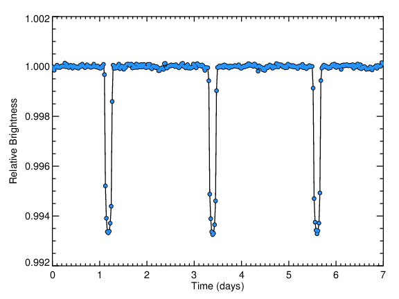
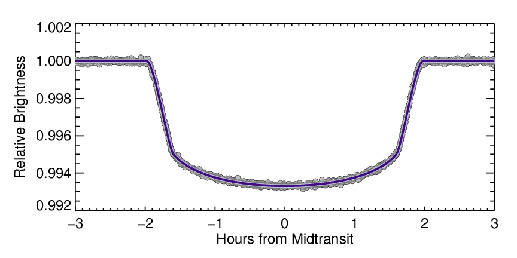

# ThreeBody
Here, we analyze the Luminosity Time Series Data from the Kepler Space Probe in order to identify Stable Three-Body Systems, as part of an IRP at NUS High School.

## Detecting Stable Three-Body Systems
Team: Ernest, Prannaya, Vikram, ~~Yuan Xi~~

Mentor: Dr Bernard Ricardo

To be done in Year 4/5 - still up in the air

Starts on: **12 May 2021**

## Proposal

### Rationale
After reading the science fiction novel The Three-Body-Problem by Liu Cixin, I was curious if the mathematical equations and the science used in the book was accurate (it was not). I read up on the Three-Body Problem in orbital mechanics and was intrigued by the deterministic chaotic series of the three bodies rotating about each other; as I had done some research into chaotic series in Year 2, I decided to delve further into this issue in Year 4.

### Historical Background
Out of the stars observed in the known galaxy, most of them are binary-star systems (“Actually most stars are in binary systems. Perhaps up to 85% of stars are in binary systems.” [1]) (“As of July 2019, astronomers have found 97 planetary systems containing 143 planets around binary stars.” [2]) although recent research has found that there are significantly more single-star systems than we think. (“Red dwarfs are so dim that it's only been in the past decade or so that technology has improved to the point where astronomers can study them in detail. And they've found that only about 25 percent of red dwarfs have stellar companions. Lada concludes that upwards of two-thirds of all star systems in the galaxy are single, red dwarf stars. His findings were detailed in a recent online edition of Astrophysical Journal Letters.” [3]) However, there has been a general consensus that it would be unlikely to find a 3-body star system—that is, until the discovery of HS Hydra, a binary-star system influenced by the gravitational field of a third, further star that shifted its eclipse and made the orbit harder to detect. General consensus may be changing— although historically, there have been found no star systems with three bodies in a constant and predictable orbit around one another. It is theorized that from the equation dictating the orbits of three stellar bodies that three stellar bodies of equal mass, size, and shape would orbit one another in a predictable pattern. This can be explained by a mathematical theorem, which tells us that in a three-body problem, the lightest mass eventually gets ejected.[4]

We will be looking at the “special case” solutions to the three-body problem to determine if our star system is one of the special cases. We will be considering Euler’s three-body solutions, Lagrange’s equilateral triangle solutions, Meissel’s Pythagorean three-body solution, the Broucke–Henon–Hadjidemetriou family of solutions, the figure-8 orbit solution, the equal-mass zero-angular-momentum three-body solutions, and possibly the free-fall solutions to the three-body problem. Statistically, finding three bodies of equal mass in a stable orbit is improbable, and thus we will be focusing on Lagrange’s equilateral triangle solutions. In Lagrange’s special case to the three-body problem, he proposes that a light mass orbiting two larger masses can be stable if they form an equilateral triangle with the larger mass, in the rotating frame of reference. The position of the light mass in the rotating frame is called a Lagrange point. In principle, for the two rotating masses, there are 5 Lagrange points, but only L4 and L5, which form equilateral triangles with the two large masses, are stable. (Figure 1.0)

Figure 1.0. The Lagrange Points about 2 bodies in orbit. Only L4 and L5 are stable.

---
From Wikipedia: "Several planets have trojan asteroids near their L4 and L5 points with respect to the Sun. Jupiter has more than a million of these trojans. Artificial satellites have been placed at L1 and L2 with respect to the Sun and Earth, and with respect to the Earth and the Moon. The Lagrangian points have been proposed for uses in space exploration. "

Historically, luminosity data has been used to find binary stars far away from Earth by observing how the luminosity of the star system changes when one star moves in front of the other and they orbit back to being side by side. By observing the orbits and predicting the luminosity series that should follow, we will be able to derive patterns to find in the luminosity dataset that we are using. If light asteroids can accumulate in the Lagrange points of the Sun-Jupiter system, we can imagine that there can be such stable three-star systems in the universe. In fact, they may be more common than we think. To hunt for them, we use the Kepler data set, which contains continuous luminosity measurements for > 200,000 stars. 

### Hypothesis
The orbits of three astral bodies around a central LaGrange point where the three bodies are roughly equivalent in mass, shape, and size, is predictable and constant. Therefore, the luminosity of the star system should also dim and brighten in a constant predictable pattern. Since the luminosity data of the night sky is available, we hypothesize that by studying the luminosity readings of star systems in the sky, we might be able to observe the predicted pattern of luminosity indicating a stable three-body star system in constant and predictable orbit. 

### Experiment
We will run a program to analyse the luminosity data graphs (Figures 3.1, 3.2, 3.3) in order to find a specific pattern of luminosity. If we succeed in doing so, we will examine the readings from the star system more carefully to see if our hypothesis is correct and that this arrangement of three stellar bodies will always orbit in a certain way. If not, then we have discovered a three-body configuration that descends into chaos by an unknown factor.

Figure 3.1. Luminosity Graph Depicting a Smaller, Darker Star Passing In Front of a Larger, Brighter Star in Days

Figure 3.2. Luminosity Graph Depicting a Smaller, Darker Star Passing In Front of a Larger, Brighter Star in Hours

Figure 3.3. Luminosity Graph Depicting Two Smaller Darker Bodies Passing In Front of a Larger Brighter Star in Minutes

### Methodology and Apparatus
We will primarily be using Python to analyse the luminosity data from NASA’s Kepler Space Probe’s archives. We will do so first via a beam scan through the time series data obtained of an area with loose requirements in order to find a group of possible candidates. Once this group of possible candidates with roughly accurate changes in luminosity is identified, we will then perform more rigorous studies on this screened group, narrowing it down until we can run an intensive search algorithm to see if such a system with matching characteristics exists. The only required resource is computational power, which should not be required in such high amounts as to necessitate the purchasing of computing time, though such an avenue is open should the situation demand it. 

### References

1. [Australia National Telescope Facility, Introduction to Astronomy](https://www.atnf.csiro.au/outreach/education/senior/astrophysics/binary_intro.html#:~:text=Actually%20most%20stars%20are%20in,distances%20of%20binaries%20vary%20enormously)
2. [Astronomy.com, Jan 7, 2020](https://astronomy.com/magazine/ask-astro/2020/01/can-solar-systems-exist-in-a-binary-star-system#:~:text=A%3A%20Yes%2C%20planetary%20systems%20can,143%20planets%20around%20binary%20stars)
3. [Space.com, Lada, 2006](https://www.space.com/1995-astronomers-wrong-stars-single.html)
4. [Kobayashi, March 13, 2012](https://iopscience.iop.org/article/10.1088/0004-637X/748/2/105)

# Admin

**Prannaya + Yuan Xi**: Get the data, clean up the data, and figure out binary star system light curve patterns
(essentially data preprocessing)

**Vikram**: Using the patterns, filter out the binary and exoplanet systems, but also apply many signal processing algorithms. This can only start from 2 August... so um yes.

### Links
- [Kepler Mission Page](https://archive.stsci.edu/missions-and-data/kepler)
- [K2 Mission Page](https://archive.stsci.edu/missions-and-data/k2)
- [Other Missions](https://archive.stsci.edu/missions-and-data)
- [Data Products Page](https://exoplanetarchive.ipac.caltech.edu/docs/Kepler_Data_Products_Overview.html)
- [Data Products Diagram](https://exoplanetarchive.ipac.caltech.edu/images/Kepler_Data_Products_Diagram.pdf)
- [Documents](https://archive.stsci.edu/missions-and-data/kepler/documents)
- [Dataset](https://exoplanetarchive.ipac.caltech.edu/docs/data.html)

- [Transit Light Curve Tutorial](https://lweb.cfa.harvard.edu/~avanderb/tutorial/tutorial.html)

#### Data
- [directory](https://archive.stsci.edu/missions/kepler/)
- [keplerktc](https://archive.stsci.edu/missions/kepler/catalogs/kepler_ktc_kic_science_v.csv.gz)

#### Code
- [astroquery](https://astroquery.readthedocs.io/en/latest/mast/mast.html)

#### Other Studies
- [Identifying Exoplanets with Deep Learning: A Five-planet Resonant Chain around Kepler-80 and an Eighth Planet around Kepler-90](https://iopscience.iop.org/article/10.3847/1538-3881/aa9e09/pdf)
    - [Google AI Blog](https://ai.googleblog.com/2018/03/open-sourcing-hunt-for-exoplanets.html)
    - [Actual Acknoweledgement](https://blog.google/technology/ai/hunting-planets-machine-learning/)
- [Asteroseismic Modeling of 16 Cyg A & B using the complete Kepler Data Set](https://arxiv.org/pdf/1508.00946.pdf)
- [False Positives Vetting method](https://iopscience.iop.org/article/10.3847/1538-3881/aae582/pdf)

#### Guides
- [Batch File Download](https://irsa.ipac.caltech.edu/docs/batch_download_help.html)

### Configurations
- [Meissel's Pythagorean Three-Body Configuration](http://www.ucolick.org/~laugh/oxide/projects/burrau.html#:~:text=In%201893%2C%20the%20mathematician%20Meissel,the%20Newtonian%20law%20of%20gravitation.)
- [Figure 8](https://sites.math.washington.edu/~morrow/336_12/papers/adrian.pdf)

